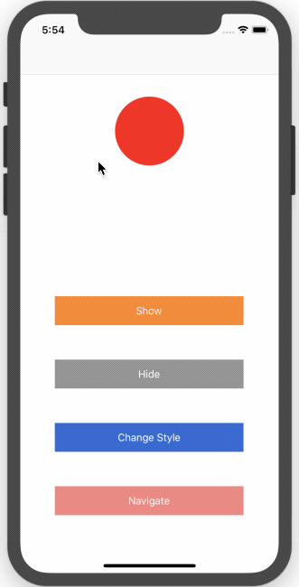

# SwiftyFloatingView

[](https://doge.mit-license.org)
[](https://developer.apple.com/swift)

## Overview

SwiftyFloatingView is a view on top of all views. you can have navigation controller, Tabbar contoller or anything. it goes on top of everyview and will be presented everywhere.


 
 
## Installation
 
### CocoaPods 

SwiftyFloatingView is available through [CocoaPods](http://cocoapods.org). To install
it, simply add the following line to your Podfile:

```ruby
pod 'SwiftyFloatingView'
```

### Manual
Drag 'n drop SwiftyFloatingView.swift into your project.
 

## Usage 


 
```swift
        let normalButton:UIButton = UIButton(type:UIButton.ButtonType.system)
        normalButton.backgroundColor = .red
        normalButton.frame = CGRect(x: 0, y: 0, width: 100, height: 100)
        normalButton.layer.cornerRadius = 50
        normalButton.addTarget(self, action: #selector(ViewController.printer), for: .touchUpInside)
        var floatingView = SwiftyFloatingView(with: normalButton)
```

## Requirements
- Swift 4.2
- iOS 8.0+

## Contact & Contribute

 - Feel free to contact me with ideas or suggestions at swiftykit@gmail.com
 - Fork the project and make your own changes

 
## License

SwiftyFloatingView is available under the MIT license. See the LICENSE file for more info.
